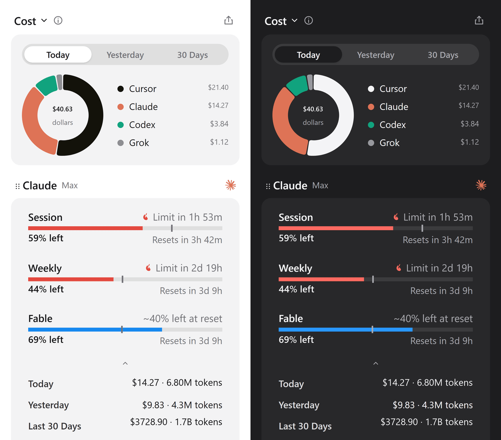

<p align="center">
  
</p>

<h1 align="center">Usage01</h1>

<p align="center">
  Track usage and limits across your AI coding tools.
</p>

<p align="center">
  <a href="https://github.com/deviffyy/OpenQuota/actions/workflows/ci.yml"></a>
  <a href="https://github.com/deviffyy/OpenQuota/releases/latest"></a>
  <a href="https://github.com/deviffyy/OpenQuota/releases"></a>
  <a href="LICENSE"></a>
</p>

Usage01 brings usage data from Claude Code, Codex, Cursor, Copilot, and other AI coding providers
into one compact panel. See session and weekly limits, reset times, token usage, and estimated
spend at a glance.

<p align="center">
  
</p>

## Download

| Platform | Available builds                           | Download                                                                      |
| -------- | ------------------------------------------ | ----------------------------------------------------------------------------- |
| Windows  | x64 and ARM64 installers                   | [Download for Windows](https://github.com/deviffyy/OpenQuota/releases/latest) |
| macOS    | Universal DMG for Apple Silicon and Intel  | [Download for macOS](https://github.com/deviffyy/OpenQuota/releases/latest)   |
| Linux    | x64 and ARM64 AppImage and Debian packages | [Download for Linux](https://github.com/deviffyy/OpenQuota/releases/latest)   |

Open the latest release and choose the file for your platform:

- **Windows:** `_x64-setup.exe` or `_arm64-setup.exe`
- **macOS:** `_universal.dmg` — requires macOS 11 or later
- **Linux:** `.AppImage` or `.deb`

Usage01 checks for updates automatically. Update payloads are cryptographically signed with the
project's updater key, independently from operating-system package signing.

When native signing is disabled (the current default), Windows installers are not
Authenticode-signed, while the macOS app uses an ad-hoc signature and is not Apple-notarized.
Windows SmartScreen or macOS Gatekeeper may therefore ask for confirmation. Download Usage01 only
from this repository's official release page; on macOS, manual approval may be required in Privacy
& Security. Each release states its exact native-signing status in its notes.

## Supported providers

- **[Claude Code](docs/providers/claude.md)** — multiple accounts, session and weekly limits,
  model-specific usage, token history, and estimated spend
- **[Codex](docs/providers/codex.md)** — session and weekly limits, credits, token history, model
  breakdown, and estimated spend
- **[Cursor](docs/providers/cursor.md)** — total, Auto and API usage, credits, token history, and
  estimated spend
- **[Antigravity](docs/providers/antigravity.md)** — shared Gemini and Claude quota pools
- **[Copilot](docs/providers/copilot.md)** — premium requests, extra usage, chat and completion
  quotas, plus organization billing
- **[Devin](docs/providers/devin.md)** — daily and weekly limits, reset times, and extra usage balance
- **[Grok](docs/providers/grok.md)** — weekly allowance, extra usage status, token history, and
  estimated spend
- **[OpenCode](docs/providers/opencode.md)** — OpenCode Go session, weekly and monthly spend caps,
  plus local hosted usage history
- **[OpenRouter](docs/providers/openrouter.md)** — credit balance and daily, weekly and monthly spend
  (API key)
- **[Z.ai](docs/providers/zai.md)** — GLM Coding Plan session, weekly, and web-search quotas (API key)
- **[Kimi](docs/providers/kimi.md)** — Kimi Code session and weekly quotas (API key)
- **[MiniMax](docs/providers/minimax.md)** — Token Plan session and weekly quotas (API key)
- **[DeepSeek](docs/providers/deepseek.md)** — current API balance by currency (API key)
- **[TraeWork CN](docs/providers/trae-work-cn.md)** — available Trae credits through secure WebView sign-in

Most providers use credentials already available on your computer. OpenRouter, Z.ai, Kimi, MiniMax,
and DeepSeek require API keys, which you can add in Customize; Usage01 stores them securely in your
encrypted credential vault protected by the operating system credential store. TraeWork CN uses a
WebView sign-in and stores only the session cookie in the credential store. Codex subscription
limits require a ChatGPT login and are not
available in API-key-only sessions.

## Features

- **Tray or floating dashboard.** View quotas in a compact popup, or keep the panel open and move it
  around your desktop.
- **Pinned metrics.** Keep important values visible in the tray or macOS menu bar.
- **Used or left.** Display how much quota you have consumed or how much remains.
- **Usage history.** Review today, yesterday, and the last 30 days of token usage and estimated
  spend.
- **Pacing alerts.** See whether your current usage is likely to last until the next reset.
- **Custom layouts.** Reorder providers and metrics, hide rows, and choose what stays visible.
- **Desktop integration.** Launch at login, use a global shortcut, and follow the system theme.
- **Fast refresh.** Cached values appear immediately and providers refresh automatically in the
  background.

Usage01 runs locally and has no account, cloud backend, analytics, or usage telemetry of its own.

## Development

Requirements:

- Node.js 22 or later
- pnpm 11.11.0
- Stable Rust toolchain
- [Tauri 2 platform prerequisites](https://v2.tauri.app/start/prerequisites/)

Install dependencies and start the development app:

```sh
corepack pnpm install --frozen-lockfile
corepack pnpm tauri dev
```

Run the complete quality checks:

```sh
corepack pnpm verify
```

Build an installer for the current platform:

```sh
corepack pnpm build:installer             # Windows
corepack pnpm build:linux                 # Linux
corepack pnpm tauri build --bundles dmg   # macOS
```

Maintainers can review updater and optional native-signing requirements in
[docs/releasing.md](docs/releasing.md).

## Contributing

Issues and pull requests are welcome. Read [CONTRIBUTING.md](CONTRIBUTING.md) before contributing,
and report security problems privately as described in [SECURITY.md](SECURITY.md).

## Acknowledgements

Usage01 is based on the OpenQuota project and was also inspired by [OpenUsage](https://github.com/robinebers/openusage) and developed as a
cross-platform alternative for Windows, Linux, and macOS.

## License

[MIT](LICENSE)
